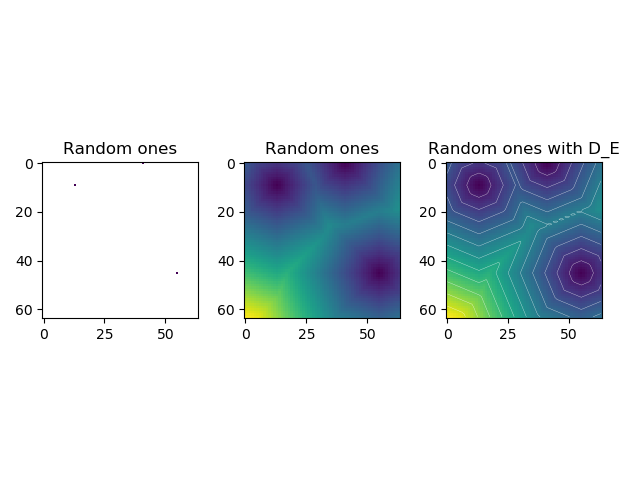
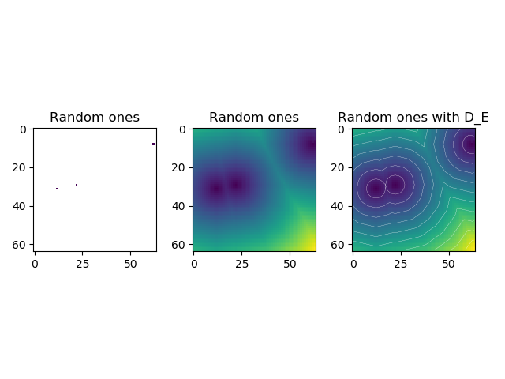

##Distance Transform by multiple distance method

Distance transform is two pass algorithm. using local mask.
  
In first pass, calculate weight of distance at left, top part of filer.  
In second pass, calculate weight of distance at right, bottom part of filter.  
  
*Below figure is simple random points distance transform result using this code.*  
  
---
* Euclidean 3 by 3 neighborhood calculation.  

---
* Euclidean 5 by 5 neighborhood calculation.  
